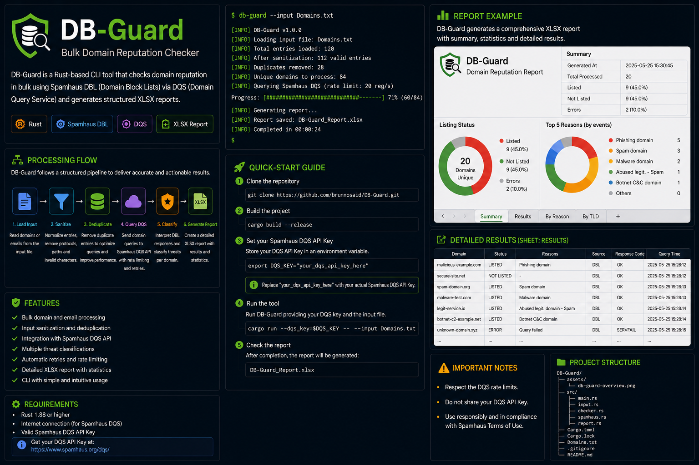

<div align="center">

# 🛡️ DB-Guard

### Bulk Domain Reputation Checker

**A fast and lightweight Rust CLI for bulk domain reputation analysis using Spamhaus DBL/DQS.**

<br>


<br>

DB-Guard processes large lists of domains and email addresses, sanitizes and deduplicates the input, queries the **Spamhaus Domain Blocklist (DBL)** through **DQS**, classifies the returned reputation data, and generates a structured **XLSX report** for further analysis.

</div>

---

## 📸 Overview

<p align="center">
  
</p>

---

## 🎯 Why DB-Guard?

Checking a few domains manually is simple.

Checking **hundreds or thousands of domains** collected from email security logs, message traces, incident investigations, or threat-hunting activities is not.

DB-Guard automates this workflow:

```text
Raw Input
   │
   ▼
Sanitization
   │
   ▼
Domain Extraction
   │
   ▼
Deduplication
   │
   ▼
Spamhaus DQS
   │
   ▼
DBL Classification
   │
   ▼
XLSX Report
```

The goal is to transform large and potentially noisy datasets into a clean list of unique domains with actionable reputation information.

---

## ✨ Features

- ⚡ **Bulk processing** of domains and email addresses
- 🧹 **Automatic input sanitization**
- 📧 Extracts domains from email addresses
- 🔁 **Automatic deduplication** before querying
- 🛡️ Integration with **Spamhaus DBL**
- 🔐 Support for authenticated **Spamhaus DQS queries**
- 🔎 Automatic interpretation of DBL response codes
- 🧠 Classification of multiple domain reputation categories
- ⚙️ Asynchronous DNS queries with controlled concurrency
- 📊 Automatic **XLSX report generation**
- 📈 Summary statistics for processed datasets
- 🚨 Separation between listed, not listed, and query errors

---

## 🧹 Input Sanitization

DB-Guard accepts a simple text file containing one entry per line.

The input can contain either domains:

```text
example.com
mail.example.com
subdomain.company.net
```

or email addresses:

```text
user@example.com
bounce-776092e70d5348f5e3bd65fbe069bed3@envios.example.com
security@company.net
```

Before querying Spamhaus, DB-Guard normalizes the entries.

For example:

```text
bounce-776092e70d5348f5e3bd65fbe069bed3@envios.example.com
```

becomes:

```text
envios.example.com
```

Other normalization cases include:

```text
<User@MAIL.Example.COM>       → mail.example.com

https://sub.example.com/path  → sub.example.com

mail.example.com:443          → mail.example.com

Example.COM.                  → example.com
```

Subdomains are intentionally preserved.

---

## 🔁 Deduplication

Deduplication happens **after sanitization**.

This means:

```text
user1@envios.example.com
user2@envios.example.com
envios.example.com
ENVIOS.EXAMPLE.COM
```

results in only:

```text
envios.example.com
```

being queried.

This reduces unnecessary DQS requests and improves processing efficiency when working with large datasets containing repeated senders.

---

## 🛡️ Spamhaus DBL Integration

DB-Guard currently uses the **Spamhaus Domain Blocklist (DBL)** as its reputation source.

Queries can be performed through the Spamhaus **Data Query Service (DQS)** using your own Query Key.

DB-Guard interprets DBL responses and classifies domains according to the returned codes.

### Supported classifications

| DBL Response | Classification |
|:---:|---|
| `127.0.1.2` | Spam domain |
| `127.0.1.4` | Phishing domain |
| `127.0.1.5` | Malware domain |
| `127.0.1.6` | Botnet C&C domain |
| `127.0.1.102` | Abused legitimate domain - Spam |
| `127.0.1.103` | Abused redirector |
| `127.0.1.104` | Abused legitimate domain - Phishing |
| `127.0.1.105` | Abused legitimate domain - Malware |
| `127.0.1.106` | Abused legitimate domain - Botnet C&C |

Operational/error responses are handled separately and are **not automatically classified as malicious domains**.

---

## 🚀 Getting Started

### Requirements

You will need:

- Rust / Cargo
- Internet connectivity
- A Spamhaus DQS Query Key for authenticated DQS queries

Clone the repository:

```bash
git clone https://github.com/brunnosaid/DB-Guard.git
cd DB-Guard
```

Build the release version:

```bash
cargo build --release
```

---

## 🔑 Configuring the DQS Key

### PowerShell

Set the key for the current terminal session:

```powershell
$env:SPAMHAUS_DQS_KEY="YOUR_DQS_KEY"
```

Then run DB-Guard normally.

---

## 💻 Usage

Create a text file containing the domains or email addresses you want to analyze:

```text
example.com
domain.example
user@company.example
bounce-id@mail.company.example
```

Then run:

```bash
cargo run --release -- --input Domains.txt
```

Or use the compiled executable directly:

```powershell
.\target\release\db-guard.exe --input .\Domains.txt
```

DB-Guard will automatically process the input and perform the configured DBL queries.

---

## ⚙️ DQS Key via CLI

The DQS key can also be provided directly:

```bash
db-guard --input Domains.txt --dqs-key YOUR_DQS_KEY
```

For regular use, however, the environment variable is preferable because it avoids exposing the key directly in command history.

---

## 📊 XLSX Reporting

After processing, DB-Guard generates:

```text
DB-Guard_Report.xlsx
```

The report separates the results into categories such as:

```text
LISTED
NOT LISTED
ERROR
```

For listed domains, the corresponding DBL classification and returned response codes are also included.

The workbook includes both detailed results and summary information, making it suitable for:

- Email security investigations
- Threat hunting
- Message trace analysis
- Domain reputation reviews
- Security incident analysis
- Large-scale sender reputation assessment

---

## 🧪 Example Workflow

A typical investigation may begin with thousands of email events:

```text
Email Security Logs
        │
        ▼
Extract Senders
        │
        ▼
Domains.txt
        │
        ▼
     DB-Guard
        │
        ├── Sanitize
        ├── Normalize
        ├── Deduplicate
        ├── Query DBL
        └── Classify
        │
        ▼
DB-Guard_Report.xlsx
```

Instead of performing repeated manual reputation checks, the analyst receives a consolidated dataset containing only the unique domains observed in the source data.

---

## 🖥️ Example Output

```text
DB-Guard

Loading input file: Domains.txt

Input lines:           8500
Valid entries:         8320
Duplicates removed:    4917
Invalid entries:       180
Unique domains:        3403

Using Spamhaus DQS mode.

Checking domain reputation...

[LISTED]     suspicious.example    Phishing domain
[LISTED]     malware.example       Malware domain
[NOT LISTED] example.com
[ERROR]      invalid.example

Generating XLSX report...

Report saved: DB-Guard_Report.xlsx
```

> Output above is illustrative of the workflow and may differ according to the current CLI version and dataset.

---

## 🏗️ Project Structure

```text
DB-Guard/
│
├── assets/
│   └── db-guard-overview.png
│
├── src/
│   ├── main.rs
│   ├── input.rs
│   ├── checker.rs
│   ├── spamhaus.rs
│   └── report.rs
│
├── Cargo.toml
├── Cargo.lock
├── Domains.txt
├── README.md
└── .gitignore
```

The project separates input processing, reputation checking, Spamhaus response interpretation, and report generation to make future expansion easier.

---

## 🗺️ Roadmap

DB-Guard currently focuses on **Spamhaus DBL reputation analysis**.

Potential future improvements include:

- [ ] Additional domain reputation providers
- [ ] Optional threat-intelligence APIs
- [ ] Additional output formats
- [ ] Improved CLI progress visualization
- [ ] Configurable caching
- [ ] Extended statistics
- [ ] Domain enrichment
- [ ] Additional email-security analysis capabilities

The long-term goal is to evolve DB-Guard from a DBL bulk checker into a lightweight **domain reputation and threat-intelligence analysis toolkit**.

---

## ⚠️ Disclaimer

DB-Guard is intended for legitimate security analysis, threat hunting, research, and defensive cybersecurity activities.

Reputation data is provided by third-party services and should not be treated as the sole indicator that a domain is malicious.

Always validate findings within the context of your investigation.

Use of Spamhaus data and DQS is subject to the applicable Spamhaus terms, policies, licensing requirements, and query limits.

---

## 🤝 Contributing

Contributions, suggestions, bug reports, and feature requests are welcome.

If you find an issue or have an idea for improving DB-Guard, feel free to open an issue or submit a pull request.

---

## 📄 License

This project is licensed under the **MIT License**.

See the `LICENSE` file for details.

---

<div align="center">

### 🛡️ DB-Guard

**From raw domains to actionable reputation intelligence.**

Built with 🦀 Rust for security analysts, threat hunters, and defenders.

</div>
